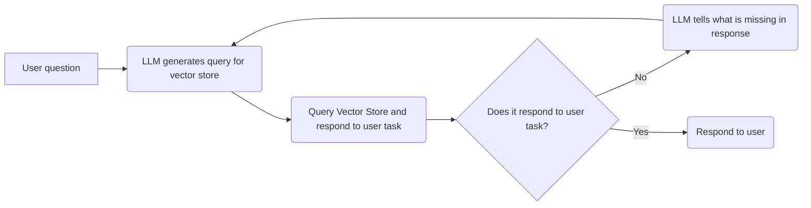

VisualAudio Flow 

# Video 
## What we want
Description (with LLM?) of: what is in video chunk(str), what objects are there(str), how object are moving there(str), how camera is moving (str), what emotions are shown (list[enum]), were there multiple changes in view(bool).
How to understand video - is camera shaking, is it professional or spontaneous.

## Process
Segmentation to chunks of 10 seconds.
Send all chunks to LLaVA NexT OV 0.5b
Then send response to some small llm which will parse to JSON.

Save this to list with: 
(response: {llm_str concat + emotions + multiple changes + is shaking + is prof} , metadata: {start_timestamp,  emotions, multiple changes, is shaking, is prof})

# Audio
## What we want
Transcription with speaker ids, loud timestamps ranges, quiet timestamps ranges

Transform video to audio
Build spectogram - we will know when it's loud, when quiet
Send whole audio to WhisparX - respond should be timestamped

Save this to list with: (response, metadata: {start_timestamp, is_loud, is_quiet})

# Output
## Audio only
- We can spot dialogs on video timeline (marked with green color)
- Spot themes of dialogs on video timeline - they can overaly on each other (sub themes)

## Video and audio
- "Dense Highlights" - based on multiple changes, emotions changes between chunks
- EVEN MORE :D

Overlay both outputs.
Save to Vector Store FAISS, each 10s is document, metadata is start time of chunk.

Now respond with overlayed outputs formatted as described below:
```json
{
    "general_summarization": "general_summarization",
    "dialogs": [
        {
            "start_time": 0.05,
            "end_time": 0.25,
            "subject": "subject_1",
            "speakers": ["speaker_1", "speaker_2"],
        }
    ],
    "themes": [
        {
            "description": "theme_1",
            "start_time": 0.5,
            "end_time": 5
        }
        {
            "description": "theme_2",
            "start_time": 2,
            "end_time": 4
        }
    ],
    "highlights": [
        {
            "description": "highlight_1",
            "reason": "reason_1",
        }
    ]
}
```

After that let's allow user to query for specific data using schema:

1. user question
2. LLM generates query for RAG
3. LLM gathers results from vector store
4. LLM asks it self is it responds to user task
5. if not return to step 2 with tips what should be generated additionally, also provide already collected data
6. respond to user



## Propozycja wizaulizacji
Po wgraniu video ui pozwala na zadawanie pytań już zaraz po rozpoczęciu analizy audio i video (pokazujemy progress analizy audio i video w trybie live - podczas analizy będziemy zapisywać "snapshoty" vector store).
użytkownik może wpisywać pytanie do podsumowania i otrzymywać je na bazie aktualnego stanu vector store.